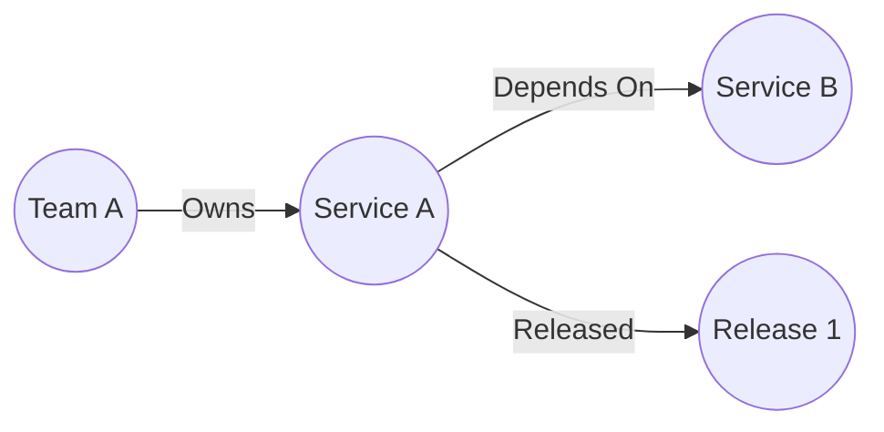

# Service Atlas Backend


A RESTful API service designed to map dependencies between services and provide basic information about services in your ecosystem.

_Note_ This API was designed as a project to learn Go. If you wish to use it, you can, but you should put it behind an API gateway or something to make it secure.

## Overview

This API allows you to:

- Track services and their metadata (name, description, GitHub repo, etc.)
- Map dependencies between services
- Associate releases with services
- Query service relationships and dependencies

## Features

- Create, read, update, and delete services
- Map dependencies between services
- Track service metadata such as:
    - Name
    - Description
    - Database dependencies
    - GitHub repository
- Associate releases with services
- Ability to add technical debt to a service
- Classify services by operational criticality using Service Tiers (1–4)

## Design Philosophy

### What Service Atlas Is

Service Atlas is a tool for understanding and surfacing relationships between systems. It exists to answer one core question: *if something changes or fails here, what else is affected?*

Debt and release tracking exist solely to support risk analysis — they are not project management tools or replacements for your work tracking software.

### What Service Atlas Is Not

**It is not an infrastructure catalog.** An API gateway and the lambdas behind it are one service — the thing your team ships and operates as a cohesive unit. The underlying cloud resources that implement it are irrelevant to the graph.

**It is not a CMDB.** Service Atlas models what engineers think about and own, not every resource that exists in your cloud account. A catalog of 10,000 items where no one can find the 50 things they care about has negative value.

**It is not an incident management system.** It informs incident response by surfacing blast radius and ownership, but it does not replace your alerting, on-call, or postmortem tooling.

### Design Principles

- **Simple by design** — a service requires only a name and a type to exist. Complexity should never be a barrier to adoption.
- **Logical over physical** — model systems as engineers understand them, not as infrastructure defines them.
- **Relationships over inventory** — the graph is the value. A service in isolation is just a record.
- **Advisory not prescriptive** — risk scores support human judgment. They do not enforce policy or predict outcomes.
- **Engineer-first** — value should flow to the people doing the work, not only upward to leadership.


## What is a "Service"
A service is a distinct, independently deployable component of a larger platform. The unit of meaning is logical, not physical — it is the thing your team reasons about, names, owns, and ships.
Service was chosen as the initial use case for this api was to catalog microservices and relations between them. Services can `depend_on` other services and have `releases` associated with them



## Debt
This application supports the recording and tracking of categorized technical debt as part of the database. Technical debt can fall into the categories below.

### Debt Types
| Type           | Notes                                                         |
|----------------|---------------------------------------------------------------|
| code           | code smells or localized poor code quality                    |
| documentation  | lack of documentation about app purpose, how tos, etc         |
| testing        | lack of types of testing                                      |
| architecture   | issues with design choices that affect the entire application |
| infrastructure | issues with the infrastructure stack the app runs on          |
| security       | security issues, such as using packages past EOL              |

### Debt Statuses
| Status      | Notes                                  |
|-------------|----------------------------------------|
| pending     | a new debt item                        |
| in_progress | actively being worked on               |
| remediated  | a debt item that is no longer an issue |

### Why track technical debt?
I think adding technical debt (or code rot) is a useful way to track and quantify issues with services. Things that are in your work tracking software (Jira, etc.)
may or may not always be picked up in a reasonable timeframe and may not be easily associated with the service in question.

## Neo4j Data Structure
Services are created under a `Service` object, while releases are created under a `Release` object.
Services can have a `Depend_ON` relationship that may have a version as part of the relationship
Services `Released` a `Release`
Services `OWNS` a `Debt`

Services also include a `tier` property to indicate operational criticality, validated to be an integer from 1 (most critical) to 4 (least critical). If not set, it defaults to Tier 3 (Supporting) behavior.

Releases will always have a date; releases without a date are assigned `now()` as the date. Releases may have an associated url, a version, or both, but require at least the url or a version to be present.

## Installation

### Prerequisites

- Go 1.26 or higher
- Neo4j database
- Docker and Docker Compose (optional, for local development)

### Using Docker Compose

1. Clone the repository
2. Start the Neo4j database:
   ```sh
   docker-compose up -d
   ```
3. Set the required environment variables:
   ```sh
   export DB_URL=neo4j://localhost:7687
   export DB_USERNAME=neo4j
   export DB_PASSWORD=password
   ```
4. Build and run the application:
   ```sh
   go build -o service-atlas ./cmd/service-atlas
   ./service-atlas
   ```

## Configuration

The application is configured using environment variables:

- `DB_URL`: URL of the Neo4j database (default: none, required)
- `DB_USERNAME`: Username for Neo4j authentication (default: none, required)
- `DB_PASSWORD`: Password for Neo4j authentication (default: none, required)

The server listens on port 8080 by default.

### CORS Configuration

The API enables CORS via middleware. You can control allowed origins and methods via the `CORS_CONFIG` environment variable. If not set or invalid, the following default configuration is used:

```
{
  "AllowedOrigins": ["*"],
  "AllowedMethods": ["GET", "POST", "PUT", "DELETE"]
}
```

To provide a custom configuration, set `CORS_CONFIG` to a JSON string with the same shape. Examples:

- Allow a single origin and limit methods to GET/OPTIONS:

```
export CORS_CONFIG='{"AllowedOrigins":["https://example.com"],"AllowedMethods":["GET","OPTIONS"]}'
```

- Allow multiple specific origins and common methods:

```
export CORS_CONFIG='{"AllowedOrigins":["https://app.example.com","https://admin.example.com"],"AllowedMethods":["GET","POST","PUT","DELETE","OPTIONS"]}'
```

Notes:
- The value must be valid JSON; invalid JSON will be ignored and the default will be used.
- `AllowedOrigins` accepts `"*"` to allow all origins or a list of exact origin URLs.
- Only the specified HTTP methods are allowed for CORS preflight and actual requests.

## API Endpoints

For more information on endpoints, see the [Bruno Collection](./HTTP_COLLECTION)

## ChangeLog
### V1.4.0
_Date: 2025-12-19_
- Introduces Service Tiers (criticality classification) with `tier` field on Service (allowed values 1–4)
- Validates tier values and returns `tier` in API responses
- Supports creating, updating, and querying services by `tier`
- Defaults existing/unspecified services to Tier 3 behavior

### V1.2.0
_Date: 2025-11-09_
- Refactors to use Chi http routing library
- Adds support for associating teams to services
- Adds test container tests to neo4j repositories

## Service Tiers (Criticality Classification)

### Summary
Service Tiers introduce a `tier` attribute on `Service` to represent how critical a component is to the overall operation of the platform. This helps reason about impact, prioritize work, and understand dependency risk across the system.

### Tier Model
Use 4 tiers, where Tier 1 is the most critical.

- Tier 1 — Mission Critical
  - Core to the platform’s primary purpose
  - Outage results in total or near-total platform failure
  - High customer, revenue, or availability impact
- Tier 2 — Business Critical
  - Platform remains partially functional if down
  - Significant degradation of key features or workflows
  - High user impact, but not a full outage
- Tier 3 — Supporting
  - Enhances or supports core functionality
  - Failures are noticeable but tolerable short-term
  - Often asynchronous or auxiliary services
- Tier 4 — Non-Critical / Auxiliary
  - Minimal operational impact if unavailable
  - Internal tools, dashboards, or experimental components

### Scope
- New `tier` field on the Service model
- Validation of allowed tier values (1–4)
- Default behavior for existing services: if unset, treat as Tier 3
- API support for creating, updating, and querying services by `tier`
